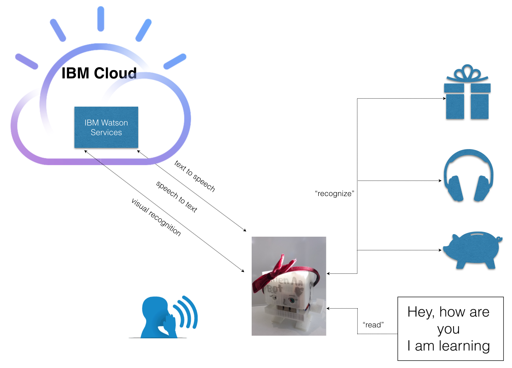

# Thien An Bot Lightup

This recipe guides you through how to connect your Raspberry Pi to IBM Watson services and make a simple robot which can listen to your commands, recognize objects, report back in voice. It can also read text content in English.

Click [here](https://youtu.be/ls16g3OT6JE) or on the picture below to see the demo:

[](https://youtu.be/ls16g3OT6JE)

## Architecture overview



## Hardware requirements

- A Raspberry Pi B. I use Raspberry 3 for this tutorial, which has built-in wifi. If you have other models, need to make sure you have Wifi dongle or other ways to get your Pi connected to the internet (eg: sharing through ethernet, etc)
- Speaker. I use an Anker A7910 mini speaker
- Raspberry pi camera

## Other requirements

- IBM Cloud account, [free](https://bluemix.net)
- Refer to [this](https://www.youtube.com/watch?v=PPvIBH7M32Y) to know how to setup your Pi. Try to get the latest OS version.
- Git, Node.js, npm on your Raspberry: `sudo apt-get install nodejs npm node-semver`

## Steps to cook the recipe

### Create Watson text to speech service

Follow [this](https://github.com/dnguyenv/distance-bot#create-bluemix-text-to-speech-service) instruction to create a text to speech service in Bluemix

### Create Watson speech to text service

Login to [Bluemix](https://bluemix.net) with your registered ID, Go to `Catalog`, Search for `speech to text` , or click [here](https://console.ng.bluemix.net/catalog/?taxonomyNavigation=iot&search=speech%20to%20text) and select the service.


Name the `service` and `credential` if you want, or just leave them by default, Select `Create`

Once the service is created, go to `Service credentials` , `View credentials` section to record the `username` and `password` information. You will need it later for the app. You can always create a new `credential` to access the service as needed, by selecting `New credential`


### Create Watson Visual Recognition service

Similarly to the Text To Speech and Speech To Text service, create a Visual Recognition service and then record the credentials to be used later in the code


### Install OCR application on your Pi

```
sudo apt-get install tesseract-ocr-eng
```

### Clone the code and install dependencies

Clone the source code:

Get into your Pi using SSH or VNC client. From the terminal in your Raspberry Pi, perform this command to get the source code:

`sudo git clone https://github.com/dnguyenv/seebot.git`

Put your Watson services credentials (Text to speech, Speech to text and Visual Recognition service) into the config.js file following the template. You also can configure other values in the file to meet your need.

Run the code:

```
cd seebot
sudo npm install
sudo npm start
```

Enjoy!
